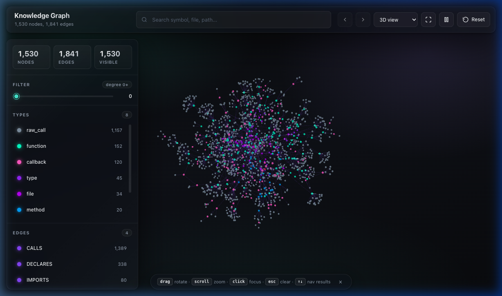

# kg-cli

`kg-cli` builds a local knowledge graph for TypeScript/JavaScript projects.
It scans source files, extracts files, symbols, imports, raw calls, resolved
call edges, framework metadata, and stores everything in a local SQLite database.

The main goal is to make a codebase easier to query from the terminal and from
AI tools through MCP.

## 🌟 Visual Demo

Experience your codebase in a dynamic 3D space with our built-in viewer.



Run the viewer with:
```bash
kg view
```

## 🚀 Key Features

- **3D Visualization**: Interactive Three.js-powered graph with neon aesthetics and 3D text sprites.
- **Deep Indexing**: Extracts symbols, imports, raw calls, and resolved call edges.
- **Framework Support**: Specialized handling for NestJS (decorators, injections) and Next.js (App Router paths).
- **AI-Ready**: Designed to provide high-quality context for AI coding assistants via MCP (Model Context Protocol).
- **Watch Mode**: Automatically re-indexes your project as you save files.


## Requirements

- Node.js `>=20`
- Yarn 1.x or npm
- A project with `.kgconfig.json`

The CLI is ESM-based and builds to `dist/`.

## Install For Development

Clone the repo, then install dependencies:

```bash
yarn install
```

Build:

```bash
yarn build
```

Run from source:

```bash
yarn dev -- --help
```

Run the built CLI:

```bash
node dist/cli.js --help
```

## Install As A Global CLI

From this repo:

```bash
yarn build
npm link
kg --help
```

Alternative:

```bash
yarn build
npm install -g .
kg --help
```

Remove the global link/install:

```bash
npm unlink -g kg-cli
```

## Initialize A Project

Inside the project you want to index:

```bash
kg init
```

This creates `.kgconfig.json`.

Example config:

```json
{
  "projectName": "my-project",
  "include": ["src/**/*.{ts,tsx,js,jsx}"],
  "exclude": [
    "node_modules/**",
    "dist/**",
    "build/**",
    ".next/**",
    "coverage/**",
    ".git/**"
  ],
  "storage": {
    "type": "sqlite",
    "path": ".kg/graph.sqlite"
  }
}
```

Recommended git behavior:

- Commit `.kgconfig.json`.
- Do not commit `.kg/`.
- Keep `.kg/` in `.gitignore`.

## Index The Project

```bash
kg index
```

Example output:

```text
Knowledge graph indexed successfully.
Storage: .kg/graph.sqlite
Nodes: 1419
Edges: 1495
Files: 33
Symbols: 209
Imports: 77
Raw calls: 1176
Call edges: 1176
NestJS semantic edges: 0
Resolved simple calls: 247
Skipped raw calls: 826
```

The index command currently rebuilds the full graph. This is intentional for
the current storage model and keeps behavior predictable.

## Query Commands

All query commands read from the SQLite graph. Run `kg index` first.

### List Files

```bash
kg query files
```

Shows indexed files with import and declaration counts.

### List Symbols

```bash
kg query symbols
```

Symbols include:

- classes
- methods
- functions
- interfaces
- type aliases
- callbacks

### Show One Symbol

```bash
kg query symbol AuthService.login
```

The symbol query accepts a simple name or qualified name. If multiple symbols
match, the CLI prints candidates and asks you to use a more specific name.

### List Imports Of A File

```bash
kg query imports src/auth/auth.service.ts
```

### List Dependents Of A File

```bash
kg query dependents src/auth/auth.service.ts
```

This shows files that import the target file.

### List Raw Calls

```bash
kg query raw-calls
```

Raw calls are call expressions before resolution. They are useful when debugging
why a call was or was not resolved.

### List Callees

```bash
kg query callees AuthService.login
```

Shows resolved symbols called by the target symbol.

### List Callers

```bash
kg query callers UserService.findByEmail
```

Shows resolved symbols that call the target symbol.

### Analyze Symbol Impact

```bash
kg query impact UserService.findByEmail
kg query impact UserService.findByEmail --depth 5
```

Impact walks incoming `CALLS` edges and reports affected callers/files.

### Analyze File Impact

```bash
kg query impact-file src/users/user.service.ts
kg query impact-file src/users/user.service.ts --depth 5
```

This analyzes every declared symbol in a file and reports callers that may be
affected.

### AI-Friendly Symbol Context

```bash
kg query context AuthService.login
```

This is the most useful terminal command when preparing context for an AI tool.

It returns:

- symbol file
- callers
- callees
- dependency injections
- injected-by relationships
- imports
- affected files

Example shape:

```text
Symbol: AuthService.login

File:
- src/auth/auth.service.ts:12

Callers:
- AuthController.login
  file: src/auth/auth.controller.ts:20

Callees:
- UserService.findByEmail
  file: src/users/user.service.ts:8

Injections:
- UserService
  file: src/users/user.service.ts:5

Injected by:
- AuthController
  file: src/auth/auth.controller.ts:7

Imports:
- src/users/user.service.ts

Affected files:
- src/auth/auth.controller.ts
```

## NestJS Support

`kg-cli` understands a useful subset of NestJS semantics.

### Constructor Injection

Given:

```ts
@Injectable()
export class AuthService {
  constructor(private readonly userService: UserService) {}

  async login(email: string) {
    return this.userService.findByEmail(email);
  }
}
```

The call resolver can resolve:

```text
AuthService.login -> UserService.findByEmail
```

It also creates:

```text
AuthService INJECTS UserService
```

### Module Metadata

Given:

```ts
@Module({
  imports: [],
  controllers: [AuthController],
  providers: [AuthService]
})
export class AuthModule {}
```

The semantic parser creates:

```text
AuthModule CONTAINS AuthController
AuthModule PROVIDES AuthService
```

Query a module:

```bash
kg query module AuthModule
```

Output includes:

- controllers
- providers
- module imports
- constructor injections

### Route Metadata

Given:

```ts
@Controller("auth")
export class AuthController {
  @Post("login")
  login() {}
}
```

The symbol metadata includes:

```text
nestjs.kind: route_handler
nestjs.route: POST /auth/login
```

Query it:

```bash
kg query symbol AuthController.login
```

## Next.js App Router Support

`kg-cli` infers routes from file paths under an `app` directory.

Examples:

```text
src/app/page.tsx                     -> /
src/app/[locale]/products/page.tsx   -> /[locale]/products
src/app/api/users/route.ts           -> /api/users
src/app/(marketing)/about/page.tsx   -> /about
```

Route groups like `(marketing)` are ignored in the route path.

Parallel route segments like `@modal` are ignored.

### List Routes

```bash
kg query routes
```

Filter by kind:

```bash
kg query routes --kind page
kg query routes --kind api_route
```

Supported route kinds:

- `page`
- `api_route`
- `layout`
- `loading`
- `error`
- `not_found`

### Show Route Context

```bash
kg query route /api/users
kg query route / --kind page
```

If more than one file maps to the same route, use `--kind`.

Route context includes:

- route path
- route kind
- file
- declared symbols
- imports
- dependents

## Watch Mode

```bash
kg watch
```

By default, watch mode runs an initial index, then watches for changes.

Skip the first index:

```bash
kg watch --no-initial
```

Set debounce:

```bash
kg watch --debounce 100
```

Watch mode uses the static root of each include pattern. For example:

```json
{
  "include": ["src/**/*.{ts,tsx,js,jsx}"]
}
```

This watches:

```text
src
```

Current behavior is full re-index on change. True incremental indexing is a
future improvement.

## MCP Server

`kg-cli` can run as an MCP server over stdio:

```bash
kg mcp
```

The server uses newline-delimited JSON-RPC over stdin/stdout. Logs and errors
that are not protocol responses should go to stderr.

### Example MCP Config

Use this shape in clients that support MCP server configuration:

```json
{
  "mcpServers": {
    "kg-cli": {
      "command": "kg",
      "args": ["mcp"],
      "cwd": "/absolute/path/to/your/project"
    }
  }
}
```

The `cwd` must point at a project with `.kgconfig.json`.

Run `kg index` before asking the MCP server questions.

### MCP Tools

#### `get_symbol_context`

Input:

```json
{
  "symbol": "AuthService.login",
  "depth": 3
}
```

Returns:

- symbol summary
- callers
- callees
- injections
- injected-by relationships
- imports
- affected files

#### `find_callers`

Input:

```json
{
  "symbol": "UserService.findByEmail"
}
```

Returns resolved callers.

#### `find_callees`

Input:

```json
{
  "symbol": "AuthService.login"
}
```

Returns resolved callees.

#### `find_file_dependencies`

Input:

```json
{
  "file": "src/auth/auth.service.ts"
}
```

Returns:

- imports
- dependents
- declared symbols

#### `analyze_impact`

Input:

```json
{
  "symbol": "UserService.findByEmail",
  "depth": 3
}
```

Returns affected callers/files.

#### `get_project_map`

Input:

```json
{}
```

Returns indexed files, symbols, and framework routes.

#### `get_route_context`

Input:

```json
{
  "route": "/api/users",
  "kind": "api_route"
}
```

Returns route file, imports, dependents, and declared symbols.

## Packaging

Dry-run package contents:

```bash
npm pack --dry-run
```

The package includes:

- `dist`
- `README.md`
- `package.json`

The package does not include source files because the published CLI runs from
compiled JavaScript in `dist`.

## Troubleshooting

### `Missing .kgconfig.json`

Run:

```bash
kg init
```

Or make sure your current working directory is the project root.

### `File not found in graph`

Run:

```bash
kg index
```

Then check whether the file matches the `include` patterns and is not excluded.

### `No resolved callees found`

The parser still has limits. It resolves common direct patterns, but not every
TypeScript expression.

Supported examples:

```ts
saveGraph();

const storage = new SqliteGraphStorage();
storage.saveGraph();

let storage: SqliteGraphStorage | null = null;
storage = new SqliteGraphStorage();
storage.saveGraph();

constructor(private readonly userService: UserService) {}
this.userService.findByEmail();
```

Patterns that may still be skipped:

- complex factory return inference without type annotation
- generic-heavy expressions
- dynamic property access
- calls through framework containers not represented in source

### `kg query route /` is ambiguous

Next.js can have both `page.tsx` and `layout.tsx` for `/`.

Use:

```bash
kg query route / --kind page
kg query route / --kind layout
```

### MCP tool cannot find a symbol

Make sure:

1. `kg index` has been run.
2. The MCP server `cwd` points at the project root.
3. You are using the qualified name when the symbol name is ambiguous.

## Current Limitations

- Watch mode does full re-index, not incremental indexing.
- Call resolution is heuristic, not full TypeScript type-checker resolution.
- NestJS support covers common decorators and constructor injection only.
- Next.js support currently focuses on App Router file paths.
- The SQLite graph is local runtime data and should not be committed.

## Development Commands

```bash
yarn install
yarn build
yarn dev -- --help
yarn dev -- index
yarn dev -- query context indexProject
```

## Suggested Roadmap

- Incremental indexing by file.
- More robust TypeScript type-checker-backed resolution.
- More NestJS provider patterns:
  - custom provider tokens
  - `useClass`
  - `useFactory`
  - `@Inject()`
- Next.js component usage graph.
- More compact MCP responses for very large projects.
